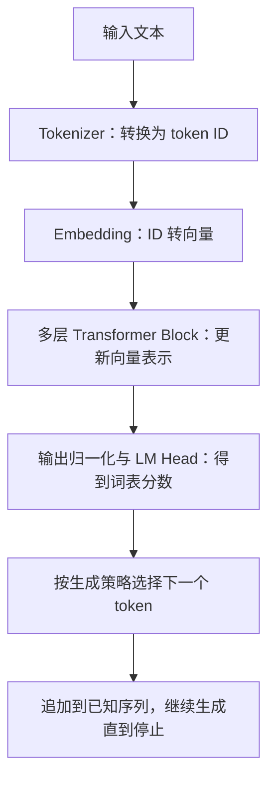

# T001 — Transformer 全局结构

日期：2026-10-09。状态：学习中；预计 15–20 分钟。B001 已掌握后继续的新课，尚未正式归档。本日动态见[原日报](2026-10-09.md#最新动态)，本讲义不重复新闻。

## 今日目标

能说明原始 Encoder–Decoder 与 Decoder-only 的区别，并画出从文本到下一个 token 的计算路径。本课先看整体，公式和具体算子后续逐个展开。

## 两种结构

原始 Transformer 包含两组模块：Encoder（编码器）处理输入序列，Decoder（解码器）结合编码器的输出和已知目标前缀生成后续内容。两者之间通过交叉注意力传递信息。[原论文第 3 节](https://arxiv.org/html/1706.03762v7#S3)

例如翻译任务中，编码器处理待翻译的句子，解码器利用这些表示逐步产生译文。“编码”在这里指神经网络计算，不是加密。

之后的许多生成式模型采用 Decoder-only。以 Qwen2 文本模型为例，主体由带因果注意力和前馈网络的 Transformer 层组成；提示词和已生成内容作为同一序列的前缀，预测下一个 token。它不依赖原始翻译结构中那组独立的 Encoder。[Qwen2 技术报告第 2.2 节](https://arxiv.org/html/2407.10671v4#S2.SS2)

这里用具体版本建立基线，不把所有模型都归为一种结构。

## Decoder-only 的一次生成

token 是模型处理的离散单位，可能对应一个字、词的一部分或其他片段；不固定等于一个汉字。



这是整体示意，具体归一化位置、位置编码方式和生成实现要以模型为准。位置的信息也参与计算；使用 RoPE 的模型在注意力计算中处理它，不能把所有位置机制都画成 Embedding 后加一个向量。

一个常见的 Block 包含以下计算：

| 部件 | 本课先理解的作用 |
| --- | --- |
| Self-Attention（自注意力） | 从允许访问的序列位置汇集信息；因果限制使当前位置不能利用后面的 token |
| FFN（前馈网络） | 对各位置的向量做特征变换，本身不直接混合不同序列位置 |
| 残差连接 | 将输入与变换结果相加，保留信息传递路径 |
| 归一化 | 调整特征数值尺度，具体方法和摆放位置随模型变化 |

原始 Transformer 的模块可查[论文第 3 节](https://arxiv.org/html/1706.03762v7#S3)。Block 的输出仍是数值向量；模型最后才通过输出头得到各候选 token 的分数。注意力不是完整模型的全部。

## 一个小形状练习

下面是人为构造的教学配置，不对应真实模型或 tokenizer：一次处理 1 条序列，3 个 token ID 为 `[2, 5, 1]`，隐藏维度为 4，词表大小为 8。

```text
token ID                   [1, 3]
Embedding 后               [1, 3, 4]
每个 Block 的输出          [1, 3, 4]
对所有位置计算 LM Head 后  [1, 3, 8]
最后位置的候选分数         [1, 8]
```

`[1, 3, 4]` 表示 1 条序列、3 个位置、每个位置 4 个数。层内可以扩展维度再投影回来；这里列的是 Block 边界形状。

拿到最后位置的 8 个分数后，选择一个 token，把它追加到序列，再进行下一步。分数叫 logits，不直接等于概率；可以通过 softmax 转成概率再采样，也可以直接选择最大分数。实际引擎可能只计算所需位置的输出头，本例用于看清完整路径。

如果一个模型有 24 层，生成一个 token 需要让相应计算经过这 24 层；不是每层各生成一个 token。下一步如何避免重算前面的内容，留到 KV Cache 专题。

## 与 NPU 实践的联系

后续实现算子时，可以沿这条路径拆解查表、矩阵乘法、归约、激活、残差相加和状态读写。今天先能标注模块的输入输出；本课没有进行代码或设备实验。

## 自测

1. Decoder-only 没有独立的 Encoder，提示词通过哪些步骤进入模型计算？
2. Self-Attention 与 FFN，哪个负责直接汇集其他序列位置的信息？
3. 模型有 24 个 Block，是否意味着一次就生成 24 个 token？请说明原因。

反馈：继续讲解 / 吃透了，归档 / 太简单，跳过。可先尝试不看讲义，画出文本到下一个 token 的路径。

## 阅读

本次核对日期：2026-10-09。

- 主阅读：[Jay Alammar：The Illustrated Transformer](https://jalammar.github.io/illustrated-transformer/)，先看整体与编码器/解码器部分；它讲解的是原始结构。
- 原始依据：[Attention Is All You Need](https://arxiv.org/html/1706.03762v7#S3)；现代具体案例：[Qwen2 技术报告](https://arxiv.org/html/2407.10671v4#S2.SS2)。
